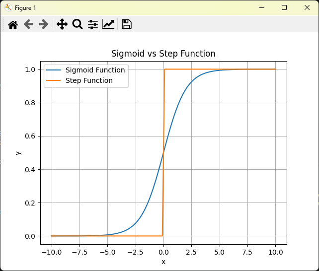
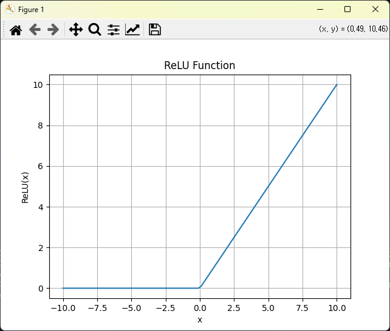
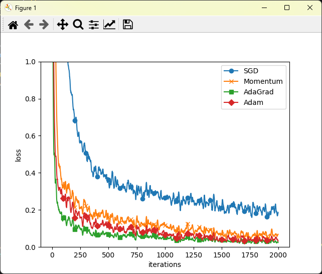
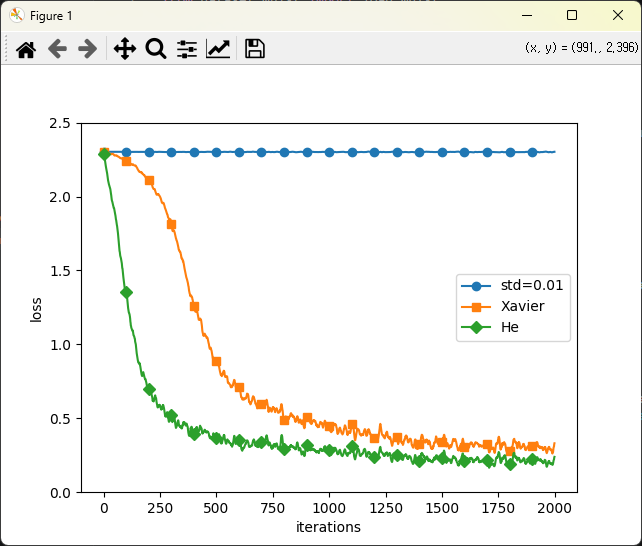

# Deep Learning Practice

Basic deep learning practice codes based on classroom exercises and selected topics from *Deep Learning from Scratch*.

## Contents

| No | File | Topic |
|:--:|------|-------|
| 01 | `01_hello.py` | Python basic output |
| 02 | `02_matplotlib_sine.py` | Basic graph visualization |
| 03 | `03_image_display.py` | Image loading and display |
| 04 | `04_perceptron_logic_gate.py` | Perceptron and logic gates |
| 05 | `05_activation_functions.py` | Step function and sigmoid function |
| 06 | `06_relu_function.py` | ReLU activation function |
| 07 | `07_numpy_dot_product.py` | NumPy array and dot product |
| 08 | `08_layer_calculation.py` | Basic layer calculation |
| 09 | `09_three_layer_network.py` | Forward propagation in a three-layer neural network |
| 10 | `10_softmax_function.py` | Softmax function |
| 11 | `11_mnist_load.py` | MNIST dataset loading |
| 12 | `12_mnist_image_show.py` | MNIST image display |
| 13 | `13_mnist_inference.py` | Neural network inference with MNIST |
| 14 | `14_numerical_gradient.py` | Numerical differentiation and gradient |
| 15 | `15_optimizer_compare.py` | Optimizer comparison |
| 16 | `16_optimizer_compare_mnist.py` | Optimizer comparison using MNIST |
| 17 | `17_weight_initialization_compare.py` | Weight initialization comparison |
| 18 | `18_dnn_mnist.py` | DNN classifier using Keras |
| 19 | `19_cnn_mnist.py` | CNN classifier using Keras |

## Sample Results

| Activation Functions | ReLU Function |
|:---:|:---:|
|  |  |

| Optimizer Comparison | Weight Initialization |
|:---:|:---:|
|  |  |

## Environment

- Python 3.9
- NumPy
- Matplotlib
- Pillow
- TensorFlow (Keras)

## Notes

- Examples are based on classroom exercises and selected topics from *Deep Learning from Scratch*.
- Some examples use the MNIST dataset for training and inference.
- Large dataset files are not included in this repository.
